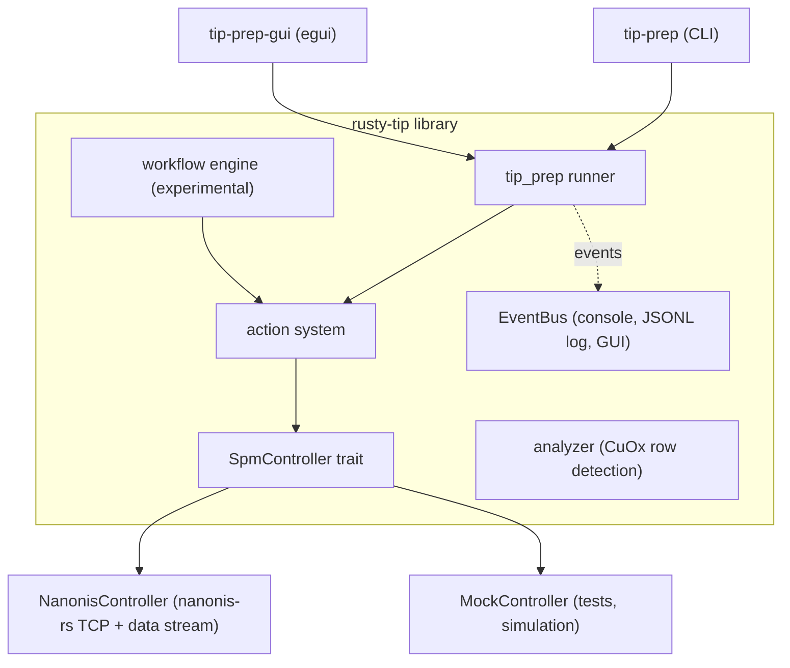

# rusty-tip

[](https://crates.io/crates/rusty-tip)
[](https://docs.rs/rusty-tip)
[](https://github.com/kronberger-droid/rusty-tip/blob/main/LICENSE)
[](https://github.com/kronberger-droid/rusty-tip/releases)
[](https://doi.org/10.5281/zenodo.20325230)
[](https://deepwiki.com/kronberger-droid/rusty-tip)

Rust library and tools for automated STM/AFM tip preparation on Nanonis SPM systems.

> [!WARNING]
> **The 0.3.x/0.4.x line is an experimental rewrite.**
> The control path was rebuilt around the `SpmController` trait and a new
> action/event system, and it has not run on a real microscope yet: every test
> in this release exercises `MockController`. The stability thresholds were
> calibrated against the v1 code path and may need retuning.
>
> Expect the API and the config format to keep moving until the rewrite gets
> machine time. For the last version that has run on hardware, see
> [0.2.3](https://github.com/kronberger-droid/rusty-tip/releases/tag/v0.2.3).

rusty-tip conditions an SPM tip automatically: it pulses, repositions, measures
the frequency shift, and repeats until the tip is sharp and provably stable.
The control logic is written against a hardware-abstraction trait
(`SpmController`), so the same routine runs against a Nanonis system over TCP,
or against an in-memory mock for tests and simulation.



## Installation

Pre-built binaries from [GitHub Releases](https://github.com/kronberger-droid/rusty-tip/releases):
`rusty-tip-x86_64-unknown-linux-gnu.tar.xz` (Linux) or
`rusty-tip-x86_64-pc-windows-msvc.zip` (Windows).

From source:

```bash
cargo build --release                 # CLI tools
cargo build --release --features gui  # + tip-prep-gui
```

As a library: `cargo add rusty-tip`.

## Quickstart

```bash
tip-prep --config path/to/config.toml
```

A minimal config:

```toml
[nanonis]
host_ip = "127.0.0.1"
control_ports = [6501, 6502, 6503, 6504]

[data_acquisition]
data_port = 6590
sample_rate = 2000

[tip_prep]
sharp_tip_bounds = [-1.5, 0.0]  # freq-shift window that counts as "sharp" (Hz)
max_cycles = 10000
max_duration_secs = 12000
initial_bias_v = -0.5
initial_z_setpoint_a = 100e-12

[pulse_method]
type = "fixed"
voltage = 4.0
polarity = "positive"
```

`tip-prep-gui` provides the same routine with live plots and an editable
configuration, plus a simulation mode that runs against the mock controller
without hardware.

## Documentation

- **[Configuration reference](docs/tip-prep/config.md)** — every section and
  field, pulse strategies, stability checking, TCP channel mapping
- **[How tip preparation works](docs/tip-prep/algorithm.md)** — the algorithm,
  cycle by cycle
- **[Library guide](docs/library.md)** — the action system, implementing
  `SpmController`, running the routine from your own code
- **[CHANGELOG](CHANGELOG.md)** — release notes

## Requirements

- Nanonis SPM controller with TCP interface enabled
- Configured TCP data logging (typically port 6590)
- Control ports accessible (typically 6501-6504)

## License

MIT
