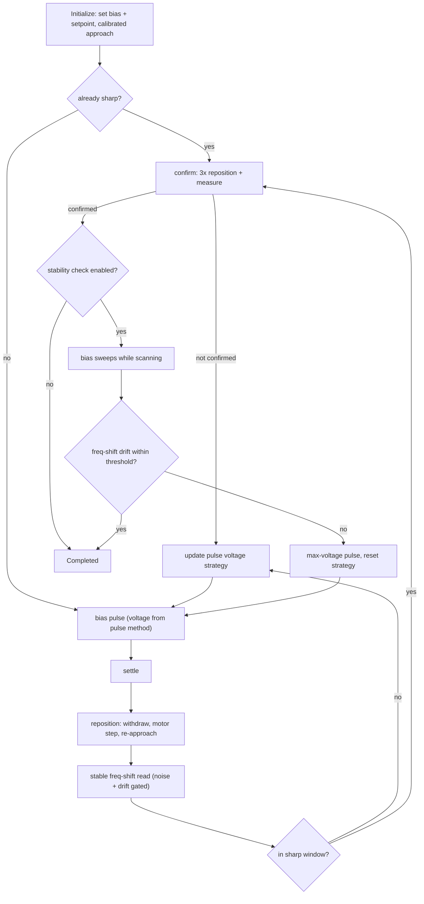

# How tip preparation works

The routine's premise: a voltage pulse changes the tip apex unpredictably, so
condition by *pulse, move somewhere fresh, measure, repeat* until the
frequency shift lands in the configured sharp window and provably stays
there.

## The pulse loop

Each cycle, in order:

1. **Pulse** with the voltage the pulse method chose (see the
   [configuration reference](config.md) for the three strategies), with the
   z-controller held.
2. **Settle**, then **reposition immediately**: withdraw, step the coarse
   motors, re-approach. The tip leaves the pulse site as fast as possible,
   since continued interaction with the pulsed spot can change the apex
   again.
3. **Measure** the frequency shift at the fresh position. A measurement is a
   batch of stream samples that must pass the noise gate (standard
   deviation) and the drift gate (regression slope in Hz/s); failing batches
   are retried with exponential backoff.
4. If the value is inside `sharp_tip_bounds`, run **confirmation**; else
   feed it to the pulse strategy and loop.

The loop ends by cycle limit, time budget, Ctrl+C (all reported as distinct
outcomes, not errors), or by passing the checks below.

## Confirmation

Sharp once could be luck: a fortunate spot, a metastable apex. The routine
repositions and re-measures three times; any out-of-window reading sends it
back to pulsing.

## Stability check

Sharp is not enough if the apex rearranges under field stress. With
`check_stability` enabled the routine:

1. Records the confirmed frequency shift as the baseline.
2. Starts a continuous scan (optionally at a configured slow speed) and
   sweeps the bias across the configured range, positive and/or negative.
3. Stops the scan, withdraws, re-approaches, and measures again.
4. Compares against the baseline: within `stable_tip_allowed_change`, the
   run is **Completed**. Beyond it, the apex moved: the routine fires a
   maximum-voltage pulse to deliberately reshape it and starts the loop
   over.

Scan properties, scan speed, and bias are restored no matter how the sweep
ends, and the tip is withdrawn before any error propagates, so a failure
mid-sweep never leaves the tip engaged on the surface.

## Cleanup

Whatever the outcome — success, limits, Ctrl+C, or a hardware error — the
routine withdraws the tip and tears the controller down before returning.
