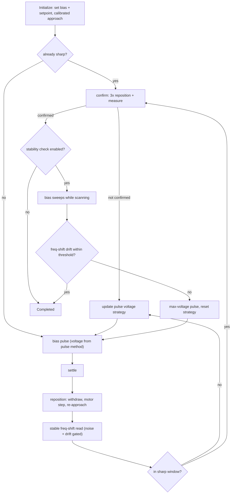

# How tip preparation works

The routine's premise: a voltage pulse changes the tip apex unpredictably, so
condition by *pulse, move somewhere fresh, measure, repeat* until the
frequency shift lands in the configured sharp window and provably stays
there.

```mermaid
flowchart TB
    init["Initialize: set bias + setpoint, calibrated approach"] --> presharp{"already sharp?"}
    presharp -- yes --> confirm
    presharp -- no --> pulse
    pulse["bias pulse (voltage from pulse method)"] --> settle["settle"]
    settle --> repos["reposition: withdraw, motor step, re-approach"]
    repos --> measure["stable freq-shift read (noise + drift gated)"]
    measure --> sharp{"in sharp window?"}
    sharp -- no --> update["update pulse voltage strategy"] --> pulse
    sharp -- yes --> confirm["confirm: 3x reposition + measure"]
    confirm -- "not confirmed" --> update
    confirm -- confirmed --> stab{"stability check enabled?"}
    stab -- no --> done["Completed"]
    stab -- yes --> sweep["bias sweeps while scanning"]
    sweep --> drift{"freq-shift drift within threshold?"}
    drift -- yes --> done
    drift -- no --> maxpulse["max-voltage pulse, reset strategy"] --> pulse
```

## The pulse loop

Each cycle, in order:

1. **Pulse** with the voltage the pulse method chose from the last reading
   (see the [configuration reference](config.md) for the three strategies),
   with the z-controller held. The reading behind the first pulse is the
   one taken after the initial approach; behind the first pulse after a
   stability reset, one taken at the fresh site the reset repositioned to.
2. **Settle**, then **reposition immediately**: withdraw, step the coarse
   motors, re-approach. The tip leaves the pulse site as fast as possible,
   since continued interaction with the pulsed spot can change the apex
   again.
3. **Measure** the frequency shift at the fresh position. A measurement is a
   batch of stream samples that must pass the noise gate (standard
   deviation) and the drift gate (regression slope in Hz/s); failing batches
   are retried with exponential backoff.
4. If the value is inside `sharp_tip_bounds`, run **confirmation**; else
   feed it to the pulse strategy and loop.

The loop ends by cycle limit, time budget, Ctrl+C (all reported as distinct
outcomes, not errors), or by passing the checks below.

A config sent while the run is going (the workbench's Reload config) is
taken between two cycles, before the budgets are checked for the next, so
a lowered limit ends the run without another pulse. Never inside a
confirmation or stability check, and nothing is written to the controller
for it: the initial bias and setpoint, the Z preset, the safe-tip threshold
and the connection tables stay as the run started and apply from the next
run. A changed pulse method starts over from its own first voltage. The
log records each switch as `tip_prep/config_reloaded`.

## Confirmation

Sharp once could be luck: a fortunate spot, a metastable apex. The routine
repositions and re-measures three times; any out-of-window reading sends it
back to pulsing.

## Stability check

Sharp is not enough if the apex rearranges under field stress. With
`check_stability` enabled the routine:

1. Records the confirmed frequency shift as the baseline.
2. Starts a continuous scan (optionally at a configured slow speed) and
   sweeps the bias across the configured range, positive and/or negative.
3. Stops the scan, withdraws, re-approaches, and measures again.
4. Compares against the baseline: within `stable_tip_allowed_change`, the
   run is **Completed**. Beyond it, the apex moved: the routine fires a
   maximum-voltage pulse, with the tip still engaged from the measurement,
   to deliberately reshape it, then repositions and starts the loop over.

Scan properties, scan speed, and bias are restored no matter how the sweep
ends, and the tip is withdrawn before any error propagates, so a failure
mid-sweep never leaves the tip engaged on the surface.

## Approaching

Every approach in the routine is a *calibrated* approach: auto-approach,
wait for the landing, back off 50 nm (a relative Z-home), centre the
frequency shift there, then land again by switching the Z loop on and
waiting for that landing too.

A landing is judged on the loop's input, not on a clock. The auto-approach
reports done the moment the setpoint is first crossed, while the loop is
still riding its own step response and, after coarse steps, the stage's
creep; the current sits well off the setpoint for a moment either way. So
the routine reads batches of the current until the mean is within
`landing_tolerance` of the setpoint and the batch holds still, or
`landing_timeout_ms` runs out, after which it carries on with a warning.
The second landing is made on the loop itself rather than the
auto-approach's ramp, since the integrator walks the 50 nm in on its own
and lands softly.

Safe-tip protection is switched on only for the backed-off part, after the
first landing has settled and before the second begins, and the Z
controller's status is checked after each step there. If safe-tip has
fired, the approach aborts and so does the run, rather than approaching
again into whatever tripped it. The hardware retracts the tip on a trip by
itself; the check is there so the software never undoes that.

An approach can be stopped while it runs: Ctrl+C or the GUI's stop button
lands within a poll interval (100 ms), switches the auto-approach off so
the controller stops stepping, and the run ends as stopped by the user
with the usual cleanup. An approach that overruns its budget is switched
off the same way and ends the run in an error.

## Cleanup

Whatever the outcome — success, limits, Ctrl+C, or a hardware error — the
routine withdraws the tip, backs the coarse motor off by
`exit_retract_steps` (two by default; 0.2.3 used ten), puts safe-tip back
the way it was before the run, and tears the controller down before
returning. The withdraw alone only parks the tip at the top of the piezo
range; the coarse retract is what puts real distance behind it. The
connection and the data stream stay up: they belong to whoever owns the
controller, not to the run.
